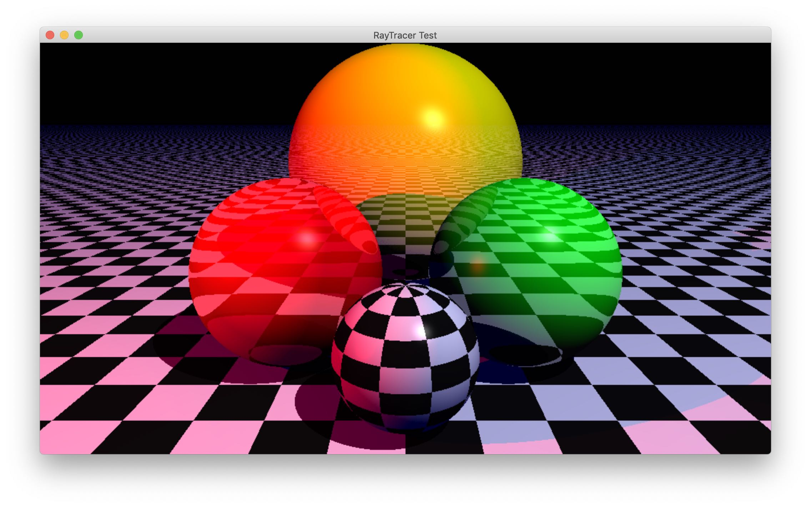

# Raytracer in Rust

Toy project to test the Rust programming language and understand how a Ray Tracer works.

It currently uses SDL2 to display the result, so it should work on all platforms.

Development can be very erratic since it is a toy project, however if you like how
the current result, feel free to contribute!

## How to start

Tested under MacOS 10.14.6 with Rust 1.39.0.

    cargo run

The `raytracking` directory contains the main engine. The `app` directory launches the engine with a sample scene.

The sample scene is in `app/src/sample_1.rs`; it is currently the only way to define a scene.

## Features

- [X] Primitives: sphere, plane, infinite plane
- [X] Cameras: perspective, orthogonal
- [X] Colored light point
- [X] Textures: plain color, procedural checked texture
- [X] Effects: transparency
- [X] Shadow when object obstruction
- [X] Ambiant light
- [X] Diffuse light reflexion
- [X] Specular light reflexion
- [X] Light refraction
- [X] Ray launcher recursion for transparent/mirror texture

## To do

RayTracing:

- [ ] Anti-aliasing
- [ ] Color shadow when going through transparent object
- [ ] Mirror effect
- [ ] Box primitive
- [ ] Texture image mapping
- [ ] Object transformation
- [ ] Perlin effect for bump mapping

Rust:

- [ ] More unit tests
- [ ] Define a better abstraction for AnyLightObject trait
- [ ] Parallel computing
- [ ] WebAssembly compatibility
- [ ] Scene language/configuration description

## References

- [Le lancé de rayons](http://mathinfo.univ-reims.fr/image/siRendu/Documents/2004-Chap6-RayTracing.pdf) *(French)*
- [Moteur de Ray Tracing](https://www.cyril-rabat.fr/data/RAYTRACING_rapport.pdf) *(French)*
- [Projet module synthèse d'images](http://gregory.corgie.free.fr/dotclear/images/Raytracing/Rapport_Raytracing.pdf) *(French)*
- [Lancer de rayons](http://heigeas.free.fr/laure/ray_tracing/realisation.htm) *(French)*
- [Introduction à l'informatique graphique
](https://www.lama.univ-savoie.fr/pagesmembres/lachaud/Cours/INFO805/Tests/html/ig_tp2.html) *(French)*
- [Scratch a Pixel](https://www.scratchapixel.com/)
- [UV Mapping and Texturing](http://viclw17.github.io/2019/04/12/raytracing-uv-mapping-and-texturing/)
- [Ray Tracking: color and texture](http://www.bentonian.com/Lectures/AdvGraph1314/3.%20Ray%20tracing%20-%20color%20and%20texture.pdf)
- [Rust Lang](https://www.rust-lang.org/)

## License

MIT License

Copyright (c) 2019 Vincent Hiribarren

Permission is hereby granted, free of charge, to any person obtaining a copy
of this software and associated documentation files (the "Software"), to deal
in the Software without restriction, including without limitation the rights
to use, copy, modify, merge, publish, distribute, sublicense, and/or sell
copies of the Software, and to permit persons to whom the Software is
furnished to do so, subject to the following conditions:

The above copyright notice and this permission notice shall be included in all
copies or substantial portions of the Software.

THE SOFTWARE IS PROVIDED "AS IS", WITHOUT WARRANTY OF ANY KIND, EXPRESS OR
IMPLIED, INCLUDING BUT NOT LIMITED TO THE WARRANTIES OF MERCHANTABILITY,
FITNESS FOR A PARTICULAR PURPOSE AND NONINFRINGEMENT. IN NO EVENT SHALL THE
AUTHORS OR COPYRIGHT HOLDERS BE LIABLE FOR ANY CLAIM, DAMAGES OR OTHER
LIABILITY, WHETHER IN AN ACTION OF CONTRACT, TORT OR OTHERWISE, ARISING FROM,
OUT OF OR IN CONNECTION WITH THE SOFTWARE OR THE USE OR OTHER DEALINGS IN THE
SOFTWARE.